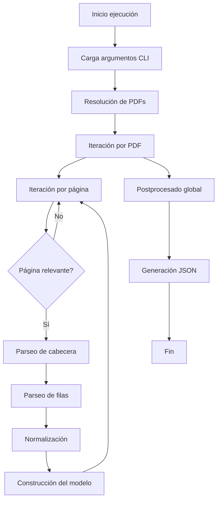
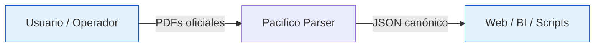
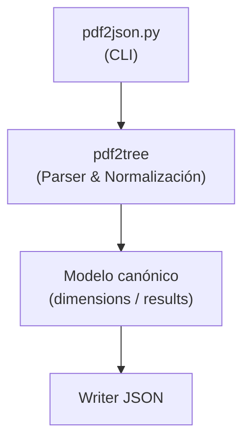
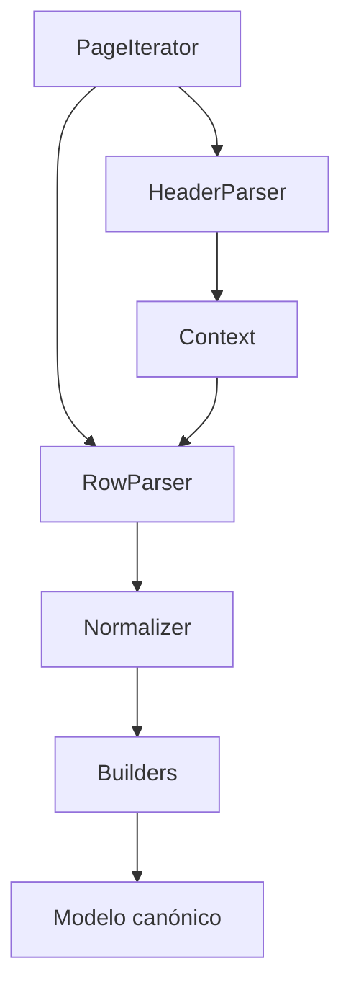
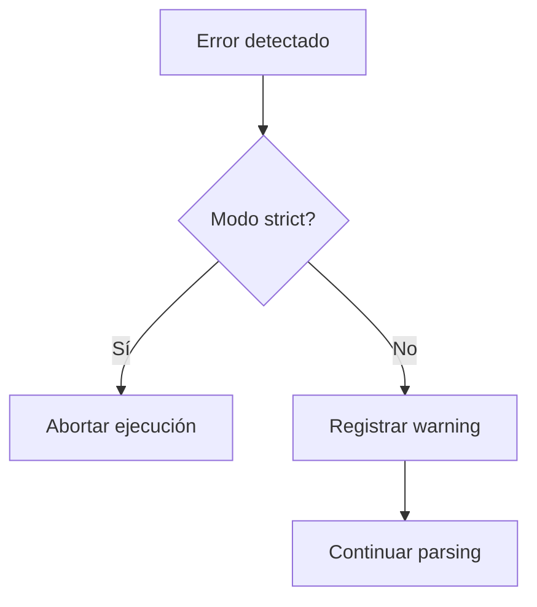
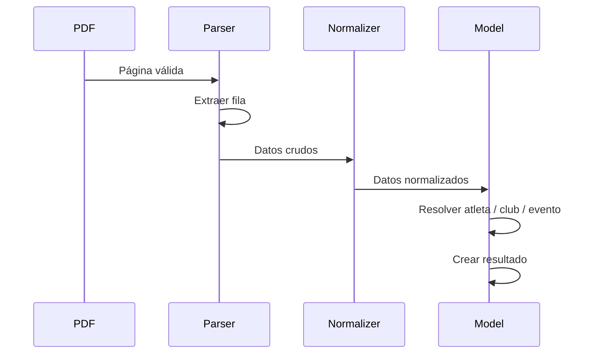
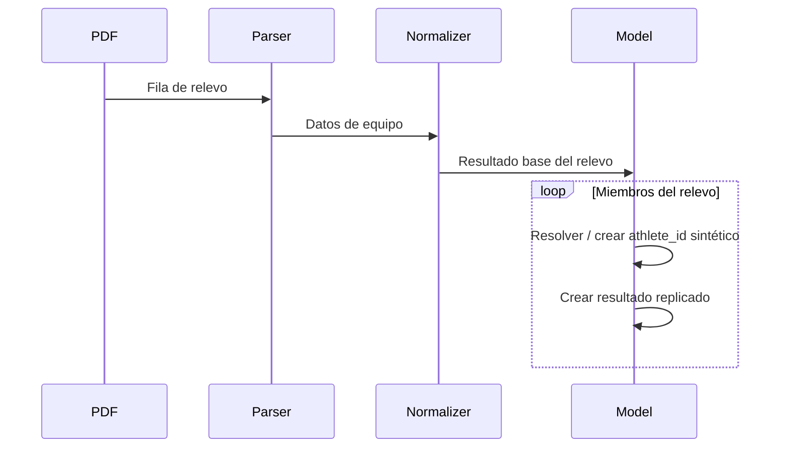
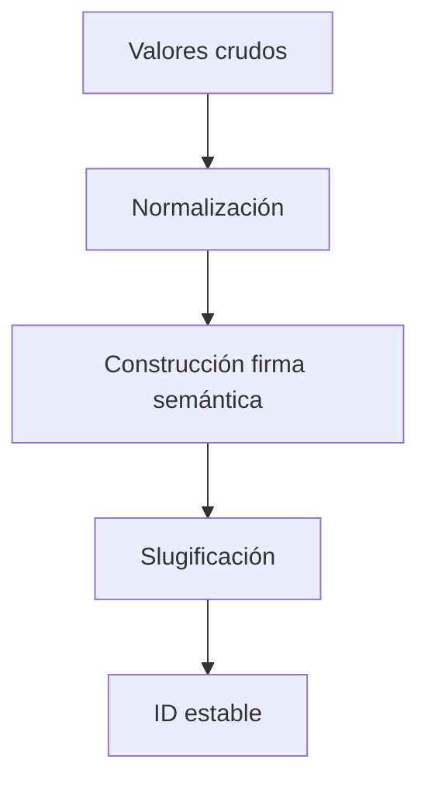

# TECHNICAL_REFERENCE.md

## Referencia técnica y transferencia de conocimiento (KT)

**Proyecto**: Pacifico – Conversión de resultados deportivos a JSON  
**Audiencia**: Desarrolladores, mantenedores, responsables de datos  
**Objetivo**: Transferencia de conocimiento completa sobre arquitectura, flujos, decisiones de diseño y reglas internas  
**Nivel técnico**: Medio–Alto  
**Versión del documento**: 1.3.1

---

## 1. Propósito de este documento

Este documento está diseñado como **material de Knowledge Transfer (KT)**. Su objetivo es que una persona que no ha participado en el desarrollo pueda:

- entender la **arquitectura completa del sistema**,
- comprender **cómo fluye la información** desde un PDF hasta el JSON final,
- conocer **las decisiones de diseño clave** y los compromisos asumidos,
- poder **modificar, extender o depurar** el sistema con seguridad y criterio.

Este documento **no sustituye al código**, pero sí explica el *porqué* de su estructura y comportamiento.

---

## 2. Visión general de la arquitectura

El proyecto sigue una arquitectura de tipo **pipeline secuencial**, donde cada fase transforma los datos y añade contexto, sin perder trazabilidad.

Fases principales:

1. **Entrada**: PDFs oficiales de resultados.
2. **Parseo estructural**: lectura página a página, detección de cabeceras y filas.
3. **Normalización**: limpieza lingüística, semántica y tipográfica.
4. **Modelado canónico**: construcción de entidades (`dimensions`) y resultados (`results`).
5. **Postprocesado**: deduplicación y remapeos.
6. **Salida**: generación del JSON contractual.

Principios de diseño fundamentales:

- **Tolerancia a errores**: el sistema prioriza no perder datos.
- **Idempotencia**: reprocesar los mismos PDFs no cambia el resultado.
- **Trazabilidad**: todo resultado puede rastrearse a su PDF de origen.
- **Estabilidad de IDs**: los identificadores no cambian entre ejecuciones.

---

### 2.1 Diagrama de flujo general del sistema



### Explicación detallada del flujo

- **Carga argumentos CLI**: se interpretan rutas, comodines y flags (`--strict`).
- **Filtro por defecto**: si no se proporciona `--club`, el CLI aplica `Pacifico` por defecto para reducir ruido en `dimensions`/`results`.
- **Resolución de PDFs**: se determina el conjunto real de archivos a procesar.
- **Iteración por página**: cada página se evalúa de forma independiente.
- **Página relevante**: se descartan páginas administrativas (ej. "clasificación general").
- **Parseo de cabecera**: se extrae contexto de competición, prueba y serie.
- **Parseo de filas**: se obtienen resultados crudos (texto OCR o estructurado).
- **Normalización**: se corrigen inconsistencias y formatos.
- **Construcción del modelo**: se crean o reutilizan entidades canónicas.
- **Postprocesado global**: deduplicaciones y remapeos finales.
- **Generación JSON**: se emite el contrato definitivo.
- **Salida JSON**: el fichero se escribe siempre en `./JSON/updatePacifico<fecha_ejecución>.json` (no configurable por argumentos).

---

## 3. Arquitectura según el modelo C4

El **modelo C4** es un enfoque de documentación arquitectónica que describe un sistema en **niveles progresivos de detalle**:

1. **Contexto**: el sistema dentro de su ecosistema.
2. **Contenedores**: grandes bloques ejecutables.
3. **Componentes**: módulos internos relevantes.

Este enfoque permite que el lector empiece con una visión global y profundice gradualmente hasta el nivel de código.

---

### 3.1 C4 – Contexto



#### Explicación

- El sistema **no interactúa directamente con bases de datos ni servicios externos**.
- Toda la entrada es explícita (PDFs) y toda la salida es explícita (JSON).
- El JSON generado actúa como **fuente única de verdad** para sistemas consumidores.

---

### 3.2 C4 – Containers



#### Explicación detallada

#### `pdf2json.py` (CLI)

- Punto de entrada del sistema.

Responsabilidades:
- Parsear argumentos de línea de comandos.
- Resolver PDFs **siempre bajo `./PDF`**.
- Orquestar el pipeline completo de parsing y normalización.
- Generar un único JSON de salida en `./JSON`.

Convenciones adoptadas:
- La ruta y nombre de salida JSON **no son configurables**.
- El filtrado por club aplica por defecto `pacifico`.
- El trace y el dump son opcionales y se activan mediante flags.

- No contiene lógica de negocio.
- La salida JSON tiene ruta y nombre fijados por convención (`./JSON/updatePacifico<fecha_ejecución>.json`).
- **Filtro por defecto**: si no se proporciona `--club`, el CLI aplica `Pacifico` por defecto para reducir ruido en `dimensions`/`results`.

#### `pdf2tree/` (núcleo del sistema)

Contiene **toda la lógica de parsing y normalización**. Es el corazón del proyecto.

Responsabilidades:

- iterar páginas de PDF,
- detectar cabeceras y cambios de contexto,
- extraer filas de resultados,
- aplicar reglas de normalización.

#### Modelo canónico

- Gestiona las estructuras `dimensions` y `results`.
- Garantiza unicidad, estabilidad y consistencia.
- Aplica reglas de deduplicación y remapeo.

#### Writer JSON

- Serializa el modelo en el contrato definido.
- No modifica datos, solo los representa.

#### Trazabilidad y dumps

El CLI soporta dos mecanismos opcionales de depuración:

- **Trace (`--trace`)**
  - Genera un fichero JSONL con eventos internos del parser.
  - Ubicación: `./JSON/trace/<salida>.jsonl`

- **Dump (`--dump`)**
  - Vuelca el texto devuelto por `extract_text()` para los PDFs procesados.
  - Ubicación: `./JSON/dump/<salida>.txt`
  - El dump concatena el contenido de todos los PDFs en una ejecución.

Si no se activan explícitamente estos flags, no se generan ficheros auxiliares.

---

### 3.3 C4 – Components (detalle de `pdf2tree`)



#### Componentes principales

#### `PageIterator`

- Recorre páginas del PDF.
- Decide si una página es relevante.
- Mantiene el estado de página actual.

#### `HeaderParser`

- Extrae información contextual:
  - competición,
  - fecha,
  - prueba,
  - tipo de serie.
- Detecta cambios de evento dentro del mismo PDF.

#### `Context`

- Estado activo compartido entre filas.
- Evita repetir información en cada fila.

#### `RowParser`

- Convierte líneas de texto en estructuras crudas.
- Tolera errores de OCR y formatos inconsistentes.

#### `Normalizer`

- Aplica reglas lingüísticas y semánticas.
- Unifica capitalización, distancias, disciplinas.
- Elimina ruido administrativo.

#### `Builders`

- Construyen entidades canónicas:
  - atletas,
  - clubes,
  - eventos,
  - resultados.

#### `Modelo canónico`
- Almacena dimensions y results.
- Punto único de verdad del sistema.

---

### 3.4 C4 - Diagrama de estados del parser

Este diagrama describe **exactamente** la lógica de `SinglePassParser`.

``` Mermaid
stateDiagram-v2
  [*] --> Idle

  Idle --> ReadingPage : Nueva página
  ReadingPage --> SkippedPage : Página irrelevante
  SkippedPage --> ReadingPage : Siguiente página

  ReadingPage --> ParsingHeader : Cabecera detectada
  ParsingHeader --> ParsingRows

  ParsingRows --> NormalizingRow : Fila leída
  NormalizingRow --> BuildingEntities
  BuildingEntities --> ParsingRows : Siguiente fila

  ParsingRows --> EndOfPage : Fin de página
  EndOfPage --> ReadingPage : Siguiente página

  ReadingPage --> [*] : Fin de PDFs
```

#### Lectura del diagrama, estados explicados

#### `Idle`
Parser inicializado, sin contexto activo.

#### `ReadingPage`
Página cargada.
Evaluación de relevancia.

#### `SkippedPage`
Página administrativa (ej. “clasificación general”).
No altera el estado del modelo.

#### `ParsingHeader`
Extracción de contexto.
Actualiza competición / prueba / serie.

#### `ParsingRows`
Iteración fila a fila.
Puede producir resultados o warnings.

#### `NormalizingRow`
Limpieza semántica y tipográfica.
No crea entidades aún.

#### `BuildingEntities`
Resolución de atletas, clubes, eventos.
Creación de resultados.

#### `EndOfPage`
Cierre limpio de página.
No resetea contexto salvo cambio explícito.

El parser es determinista, idempotente y tolerante a errores.

#### Estados

*   **`SEEK\_TABLE`\**
    Esperando cabecera real de resultados

*   **`IN\_RESULTS`\**
    Parseando filas individuales o inicio de relevo

*   **`IN\_RELAY\_MEMBERS`\**
    Acumulando miembros del relevo

El parser es `single-pass`, orientado a trazabilidad.

---

#### Transiciones críticas

| Evento          | Acción                  |
| --------------- | ----------------------- |
| `TEAM_ROW`      | Abre contexto de relevo |
| `RELAY_MEMBER`  | Añade miembro           |
| `expected_size` | Flush automático        |
| `EVENT_TITLE`   | Flush defensivo         |
| `finalize()`    | Flush final             |

**Nunca se pierde un relevo abierto**
Siempre se emiten resultados consistentes

---

### 3.6 C4 - Flujo de control de errores y fallback



#### Explicación

- En **modo normal**, el sistema intenta continuar siempre que sea posible.
- En **modo estricto**, cualquier error estructural invalida la ejecución.
- Los errores no fatales quedan registrados para auditoría.

---


### 3.5 C4 - Diagramas de secuencia

#### 3.5.1 Secuencia – Prueba individual



#### `Explicación`

Cada fila del PDF genera **exactamente un resultado**, asociado a un atleta real.

---

#### 3.5.2 Secuencia – Prueba de relevos



#### `Explicación`

Un relevo genera **N resultados**, uno por miembro, replicando los datos de equipo.

---

#### `Ejemplo de relevo estándar 4×50 m (caso normal)`

##### Contexto en el PDF

*   Prueba: `4x50 m Relevo Natación con Obstáculos`
*   Categoría: Juvenil
*   Sexo: Femenino
*   Cada equipo tiene **4 miembros**
*   El tiempo es **del equipo**, no individual

---

##### Evento (`dimensions.events`)

```json
{
  "id": "e_4x50_natacion_con_obstaculos_juvenil_f",
  "base": "4x50 m Relevo Natación con Obstáculos",
  "discipline": "Relevo Natación con Obstáculos",
  "category": "Juvenil",
  "sex": "F",
  "relay": true,
  "distance_m": "4x50"
}
```

category es una representación textual **siempre en femenino**, ya que concuerda con el sustantivo _categoría_. No depende del sexo de la prueba.

---

##### Resultados (`results`)

**IMPORTANTE**\
En relevos:

*   Se genera **UN result por cada miembro**
*   Todos comparten:
    *   `time`
    *   `position`
    *   `status`
    *   `club_id`

```json
{
  "id": "r_c_2025-02-15_madrid_e_4x50_natacion_con_obstaculos_juvenil_f_a_ana_garcia_lopez_na",
  "date": "2025-02-15",
  "season_id": "s_2024_2025",
  "competition_id": "c_2025-02-15_madrid_xxv_liga",
  "event_id": "e_4x50_natacion_con_obstaculos_juvenil_f",
  "athlete_id": "a_ana_garcia_lopez_na",
  "club_id": "club_c_d_e_pacifico_salvamento",
  "time": {
    "display": "02:10.430",
    "seconds": 130.43,
    "raw": "02:10:43"
  },
  "status": "OK",
  "position": 1,
  "series_type": "Final",
  "labels": {
    "x": "2025-02-15\n1ª Sesión 2ª Jornada XXV Liga Española"
  }
}
```

Los otros tres miembros del relevo tendrán **el mismo tiempo y posición**, pero distinto `athlete_id`.

---

##### Tree (`tree`)

```json
{
  "event_id": "e_4x50_natacion_con_obstaculos_juvenil_f",
  "base": "4x50 m Relevo Natación con Obstáculos",
  "sex": "F",
  "category": "Juvenil",
  "athletes": [
    {
      "athlete_id": "a_ana_garcia_lopez_na",
      "club_id": "club_c_d_e_pacifico_salvamento",
      "status": "OK",
      "position": 1,
      "series_type": "Final",
      "time": {
        "display": "02:10.430",
        "seconds": 130.43,
        "raw": "02:10:43"
      },
      "converted_time": "02:10.430"
    }
  ]
}
```

category es una representación textual **siempre en femenino**, ya que concuerda con el sustantivo _categoría_. No depende del sexo de la prueba.

---

#### `Ejemplo de lanzamiento de cuerda (relevo especial de 2 miembros)`

##### Particularidades

*   Es **relevo**, pero:
    *   **NO tiene distancia**
    *   **Solo 2 miembros**
*   El parser lo detecta como relay por semántica, no por `4x`

---

##### Evento

```json
{
  "id": "e_lanzamiento_de_cuerda_juvenil_f",
  "base": "Lanzamiento de Cuerda",
  "discipline": "Lanzamiento de Cuerda",
  "category": "Juvenil",
  "sex": "F",
  "relay": true,
  "distance_m": null
}
```

category es una representación textual **siempre en femenino**, ya que concuerda con el sustantivo _categoría_. No depende del sexo de la prueba.

---

##### Resultado (por miembro)

```json
{
  "athlete_id": "a_maria_perez_gomez_na",
  "club_id": "club_c_d_e_pacifico_salvamento",
  "status": "OK",
  "position": 3,
  "time": {
    "display": "00:16.330",
    "seconds": 16.33,
    "raw": "00:16:33"
  }
}
```

---

#### `Ejemplo de relevo con descalificación (DSQ)`

##### Contexto real del PDF

```text
4x50 m Relevo Natación con Obstáculos Juvenil Masculino
Socorrista / Lifeguard Año Club Final.T Score
3 C.D.E Pacífico Salvamento Descalificado
GARCIA LOPEZ, MARCOS
PEREZ DIAZ, ALBERTO
SANCHEZ RUIZ, CARLOS
MORENO GOMEZ, IVAN
```

---

##### Evento (`dimensions.events`)

```json
{
  "id": "e_4x50_natacion_con_obstaculos_juvenil_m",
  "base": "4x50 m Relevo Natación con Obstáculos",
  "discipline": "Relevo Natación con Obstáculos",
  "category": "Juvenil",
  "sex": "M",
  "relay": true,
  "distance_m": "4x50"
}
```
category es una representación textual **siempre en femenino**, ya que concuerda con el sustantivo _categoría_. No depende del sexo de la prueba.

---

##### Resultados (`results`) – **todos DSQ**

**Regla clave**\
La **descalificación es del equipo**, pero se replica en **cada miembro**.

```json
{
  "athlete_id": "a_marcos_garcia_lopez_na",
  "club_id": "club_c_d_e_pacifico_salvamento",
  "status": "DSQ",
  "position": 3,
  "time": {
    "display": null,
    "seconds": null,
    "raw": null
  },
  "series_type": "Final"
}
```

Los otros tres miembros tienen:

*   mismo `status = DSQ`
*   misma `position`
*   mismo `club_id`
*   distinto `athlete_id`

Esto es **coherente con `parse_status()` y `flush_relay_context()`**.

---

##### Tree (`tree`)

```json
{
  "event_id": "e_4x50_natacion_con_obstaculos_juvenil_m",
  "athletes": [
    {
      "athlete_id": "a_marcos_garcia_lopez_na",
      "club_id": "club_c_d_e_pacifico_salvamento",
      "status": "DSQ",
      "position": 3,
      "series_type": "Final",
      "time": {
        "display": null,
        "seconds": null,
        "raw": null
      }
    }
  ]
}
```

---

#### `Ejemplo de relevo con información incompleta (fallback de club)`

##### Caso real en PDFs

*   La fila del equipo **NO contiene nombres**
*   Solo aparece el club
*   Los miembros aparecen mal formateados o no aparecen

---

##### Comportamiento del parser (muy importante para KT)

*   Se crea un **athlete ficticio**:
    *   `athlete_id = a_<club>_na`
    *   `name = <nombre del club>`
*   Esto evita **perder el resultado**

---

##### Ejemplo

```json
{
  "id": "a_c_d_e_pacifico_salvamento_na",
  "name": "C.D.E. Pacífico Salvamento",
  "birth_year": null
}
```

Y el resultado:

```json
{
  "athlete_id": "a_c_d_e_pacifico_salvamento_na",
  "club_id": "club_c_d_e_pacifico_salvamento",
  "status": "OK",
  "position": 3.
  "time": {
    "display": "02:25.100",
    "seconds": 145.1,
    "raw": "02:25:10"
  }
}
```

---

### 3.6 C4 - Flujo de control de errores y fallback


#### Explicación

- En **modo normal**, el sistema intenta continuar siempre que sea posible.
- En **modo estricto**, cualquier error estructural invalida la ejecución.
- Los errores no fatales quedan registrados para auditoría.

---

## 4. Anexos técnicos

### Anexo A - Entrada: tipos de líneas del PDF

El sistema **NO usa posiciones**, solo **texto plano**.

#### A.1 EVENT\_TITLE

Ejemplos:

*   `50 m. Natación con obstáculos juvenil femenino`
*   `4x50 m Relevo Natación con Obstáculos`
*   `Lanzamiento de cuerda Máster 30-34`

---

#### A.2 CATEGORY\_LINE

Formato:

```text
Juvenil (Femenina)
```

Separa:

*   Categoría
*   Sexo

---

#### A.3 TABLE\_HEADER

Detecta el inicio de resultados:

```text
Socorrista / Lifeguard Año/Year Club / Team
```

👉 **Aquí se “confirma” el evento actual**

---

#### A.4 INDIVIDUAL\_ROW

Ejemplo:

```text
1 GARCIA LOPEZ, ANA 2008 C.D.E Pacífico Salvamento 00:31:93
```

Campos:

*   Posición
*   Nombre
*   Año
*   Club
*   Tiempo
*   Estado

---

#### A.5 TEAM\_ROW (relevos)

Primera fila del relevo:

```text
1 GARCIA LOPEZ, ANA C.D.E Pacífico Salvamento 02:10:34
```

---

#### A.6 RELAY\_MEMBER

Miembro adicional del relevo:

```text
PEREZ GOMEZ, MARIA
```

Se esperan:

*   4 miembros (relevos)
*   2 miembros (lanzamiento de cuerda)

---


### Anexo B – Reglas de normalización

#### B.1 Normalización de espacios y guiones

**Implementado en**: `normalize.normalize_spaces`, `normalize.normalize_dashes`

##### Reglas

*   Colapsar espacios múltiples → un solo espacio
*   Convertir guiones Unicode (`– — ‑ −`) → `-`
*   Eliminar espacios al inicio y final

##### Ejemplo

```text
"  C.D.E–Pacífico   Salvamento "
→ "C.D.E-Pacífico Salvamento"
```

---

#### B.2 Corrección de año pegado por OCR

**Implementado en**: `fix_glued_year()`

##### Problema típico

```text
1972C.D.E Pacífico Salvamento
```

##### Regla

*   Si un año `YYYY` va seguido inmediatamente de letra → insertar espacio

```text
"1972C.D.E Pacífico Salvamento"
→ "1972 C.D.E Pacífico Salvamento"
```

✅ Evita clubes falsos y atletas mal parseados.

---

#### B.3 Normalización de nombres de atletas

**Implementado en**: `normalize_athlete_name()`

##### Casos soportados

1.  **Formato con coma**

```text
"APELLIDOS, NOMBRE"
→ "Nombre Apellidos"
```

2.  **Formato sin coma**

```text
"Nombre Apellido"
→ Title Case (sin reordenar)
```

3.  **Eliminación de año residual**

```text
"GARCIA LOPEZ, ANA 2009"
→ "Ana Garcia Lopez"
```

---

#### B.4 Capitalización española (Title Case controlado)

**Implementado en**: `title_case_name_es()`

##### Reglas

*   Primera palabra: mayúscula
*   Preposiciones/conjunciones en minúscula:
    *   `de`, `del`, `la`, `y`, `en`, `con`, etc.
*   Se respetan guiones en apellidos

```text
"LLANOS DE LAS HERAS"
→ "Llanos de las Heras"
```

---

#### B.5 Normalización de clubes

**Implementado en**:

*   `clean_club_tail()`
*   `_normalize_club_display()`

##### Reglas

*   Eliminar sufijos entre paréntesis:

```text
"Club Natación X (juvenil)"
→ "Club Natación X"
```

*   Arreglar variantes de siglas:

```text
"C.D.E.Pacífico"
→ "C.D.E. Pacífico"
```

---

#### B.6 Slugificación (IDs canónicos)

**Implementado en**: `slugify()`

##### Reglas

*   Minúsculas
*   Sin acentos
*   Solo `[a-z0-9_]`
*   Separadores no alfanuméricos → `_`

```text
"C.D.E Pacífico Salvamento"
→ "c_d_e_pacifico_salvamento"
```

---

#### B.7 Normalización de tiempos

**Implementado en**: `time_raw_to_display_seconds()`

##### Formatos soportados

*   `mm:ss:cc`
*   `mm:ss.mmm`

##### Salida

*   `display`: siempre `mm:ss.mmm`
*   `seconds`: float
*   `raw`: texto original

```text
"00:31:93"
→ display="00:31.930", seconds=31.93
```

---

#### B.8 Normalización de estado (status)

**Implementado en**: `parse_status()`

##### Mapeo

| Texto detectado | Status |
| --------------- | ------ |
| vacío           | `OK`   |
| `Descalificado` | `DSQ`  |
| `No Finaliza`   | `DNF`  |
| `No Presentado` | `DNS`  |
| `Baja`          | `BAJA` |

---

#### B.9 Normalización de categoría

**Implementado en**: `normalize_category()`, `events.category_code()`

##### Reglas

*   Siempre en **femenino singular**
*   Abreviaturas soportadas:
    *   `cad`, `inf`, `juv`, `jun`, `abs`

```text
"juvenil femenina"
→ category="juvenil", sex="F"
```

---

#### B.10 Normalización de sexo

**Implementado en**: `normalize_sex()`, `events.sex_code()`

##### Valores finales

*   `M` → masculino
*   `F` → femenino
*   `X` → mixto

Soporta:

*   español
*   inglés
*   OCR imperfecto (`femenenina`, `masculnio`, etc.)

---

#### B.11 Normalización de piscinas

**Implementado en**: `normalize_pool()`

##### Entradas aceptadas

```text
"25 M", "M25", "25M", "E 50", "50E"
```

##### Salida canónica

```text
"M 25" / "E 50"
```

(usa espacio fino U+202F)

---

#### B.12 Normalización de eventos

**Implementado en**: `events.build_event_fields()`

##### Reglas clave

*   La **distancia nunca forma parte de `discipline`**
*   El **nombre base sí incluye distancia**
*   `relay=true` fuerza prefijo `"Relevo"` (excepto Lanzamiento de Cuerda)
*   `mixto` **no forma parte del nombre**

```text
"4x50 m Relevo Natación con Obstáculos Mixto"
→
base="4x50 m Relevo Natación con Obstáculos"
discipline="Relevo Natación con Obstáculos"
sex="X"
```

#### B.13 Normalización del campo `category`

El campo `category` del JSON representa una **categoría deportiva** y su valor:

- Se expresa siempre en **femenino** (por concordancia gramatical).
  - Ej.: `Absoluta`, `Combinada`
- Las categorías Máster se representan siempre como:
  - `Máster …` (con mayúscula inicial y tilde).

El género no depende del sexo de la prueba (`sex`), sino del sustantivo “categoría”.

---

### Anexo C – Reglas de creación de IDs

Los identificadores:

- se basan en valores semánticos,
- son deterministas,
- no incluyen datos volátiles,
- no dependen del orden de procesamiento.

#### C.1 Diagrama de generación de IDs



Ejemplo conceptual:

```
e_<distancia>_<disciplina>_<categoria>_<sexo>
```

---

#### C.2 Ejemplos de generación de IDs

---

##### Ejemplo 1: atleta individual

###### Entrada PDF

```text
GARCIA LOPEZ, ANA 2009
```

###### Normalización

```text
Ana Garcia Lopez
```

###### ID

```text
a_ana_garcia_lopez_2009
```

---

##### Ejemplo 2: atleta de relevo

```text
GARCIA LOPEZ, ANA
```

```text
a_ana_garcia_lopez_na
```

---

##### Ejemplo 3: club

```text
C.D.E Pacífico Salvamento
```

```text
club_c_d_e_pacifico_salvamento
```

---

##### Ejemplo 4: evento

```text
50 m Socorrista Juvenil Femenino
```

```text
e_50_m_socorrista_juvenil_f
```

---

##### Ejemplo 5: result

```text
competition_id = c_2025-02-15_madrid_xxv_liga
event_id       = e_50_m_socorrista_juvenil_f
athlete_id     = a_ana_garcia_lopez_2009
series_type    = Final
```

```text
r_c_2025-02-15_madrid_xxv_liga_e_50_m_socorrista_juvenil_f_a_ana_garcia_lopez_2009_final
```

---

### Anexo D – Reglas de deduplicación


Este apéndice documenta **reglas críticas**, muy importantes para:

*   integridad de datos
*   merges históricos
*   confianza del frontend

- **Atletas**: nombre + año (si existe).
- **Clubes**: nombre normalizado.
- **Eventos**: firma semántica completa.
- **Resultados**: clave compuesta estable.

---

#### D.1 Principios generales

1.  La deduplicación se aplica **solo en dimensiones**
2.  `results` **no se deduplican**
3.  Se prefiere **información más completa**
4.  El sistema es **monótono**:
    *   nunca elimina información “mejor”

---

#### D.2 Deduplicación de temporadas (`seasons`)

**Clave lógica**

```text
season_id
```

*   Dos temporadas con el mismo `season_id` son la misma
*   Nunca se crean duplicados por diseño

Implementado en:

*   `DimensionsBuilder.add_season()`

---

#### D.3 Deduplicación de competiciones (`competitions`)

**Clave lógica**

```text
competition_id
```

*   El ID incluye:
    *   fecha
    *   localización
    *   nombre limpio
*   Dos competiciones solo colisionan si **son realmente la misma**

Sin lógica extra de deduplicación necesaria.

---

#### D.4 Deduplicación de clubes (`clubs`)

**Clave lógica**

```text
club_id = slug(nombre_normalizado)
```

##### D.4.1 Normalización previa

*   eliminación de años OCR
*   eliminación de sufijos `(juvenil)`
*   normalización de siglas

Dos clubes con mismo nombre → mismo `club_id`

---

#### D.5 Deduplicación de atletas (`athletes`) – caso complejo

##### D.5.1 Clave lógica

```text
athlete_name_key = nombre_normalizado_sin_acentos
```

##### D.5.2 Reglas (implementadas en `DimensionsBuilder.add_athlete()`)

1.  **Primer atleta** con ese nombre → se acepta
2.  Si llega otro con el mismo nombre:
    *   si uno tiene año y el otro no:
        *   se prefiere el que **tiene año**
    *   si ambos tienen año:
        *   se conserva el primero
3.  El atleta `_na` **no se elimina inmediatamente**
    *   se conserva para poder remapear results

---

#### D.6 Reconciliación final atletas ↔ resultados

**Implementado en**

```text
reconcile_athletes_and_results()
```

##### D.6.1 Proceso

1.  Se construye:

```text
name_key → best athlete_id
```

2.  Se recorren los `results`

3.  Si un result apunta a un atleta `_na`:
    *   y existe uno con año → se remapea

4.  Finalmente:

*   se eliminan atletas no referenciados

Esto evita:

*   duplicados
*   pérdida de resultados
*   referencias rotas

---

### Anexo E - Reglas de merge entre temporadas

#### E.1 Objetivo del merge

El merge entre temporadas permite:

*   consolidar resultados históricos,
*   añadir nuevas competiciones,
*   corregir datos parciales de temporadas anteriores,

**sin romper IDs existentes ni referencias en frontend**.

Principio clave:

> **Un merge nunca invalida datos ya publicados.**

---

#### E.2 Principios generales del merge

1.  El merge se realiza **a nivel de JSON completo** (no PDF a PDF).
2.  Las dimensiones (`dimensions`) se consideran **globales**.
3.  `results` y `tree` son **dependientes de temporada**.
4.  Los IDs son la **fuente de verdad**, no los textos.

---

#### E.3 Estrategia general de merge

##### E.3.1 Orden lógico

1.  Merge de `dimensions`
2.  Reconciliación de atletas
3.  Merge de `results`
4.  Reconstrucción / validación de `tree`

```text
old.json  +  new.json
     ↓
merge dimensions
     ↓
reconcile athletes
     ↓
merge results
     ↓
rebuild tree (si aplica)
```

---

#### E.4 Merge de `dimensions`

##### E.4.1 Seasons

*   Se identifican por `season_id`
*   Dos temporadas con distinto `season_id` **coexisten**
*   Nunca se fusionan temporadas distintas

Seguro por diseño.

---

##### E.4.2 Competitions

**Clave**: `competition_id`

*   Si el `competition_id` ya existe:
    *   no se sobreescribe
    *   se considera la misma competición
*   Si no existe:
    *   se añade íntegra

Permite re‑procesar PDFs sin duplicar competiciones.

---

##### E.4.3 Events

**Clave**: `event_id`

*   Eventos con mismo `event_id` son idénticos por contrato
*   No se permite:
    *   cambiar `base`
    *   cambiar `category`
    *   cambiar `sex`

Si un evento nuevo colisiona con uno existente:

*   se conserva el primero
*   se ignora el nuevo
*   se deja traza (warning)

---

##### E.4.4 Clubs

**Clave**: `club_id`

*   Dos clubes con mismo `club_id` → mismo club
*   No se permite merge por similitud textual
*   La normalización previa evita duplicados

Los clubes son **dimensión global estable**.

---

#### E.5 Merge de `results`

##### E.5.1 Reglas

*   Los `results` se identifican por `result_id`
*   Si el `result_id` ya existe:
    *   **NO se duplica**
    *   **NO se reemplaza**
*   Si no existe:
    *   se añade

Un merge es **idempotente**.

---

##### E.5.2 Casos típicos

| Escenario                | Resultado                    |
| ------------------------ | ---------------------------- |
| Reprocesar el mismo PDF  | No cambia nada               |
| Añadir nueva competición | Se añaden results            |
| Corregir un PDF antiguo  | Se generan nuevos result\_id |

Si cambia un campo que forma parte del ID (p. ej. `series_type`), **no es el mismo result**.

---

#### E.6 Merge de `tree`

Regla fundamental:

> El `tree` **no es fuente primaria**.

##### E.6.1 Opciones válidas

*   Opción A (recomendada):  
    reconstruir `tree` desde `dimensions + results`
*   Opción B:  
    mergear solo nodos nuevos por `competition_id`

En ambos casos, `tree` **no participa en deduplicación**.

---

### Anexo F - Cómo se remapea un atleta (explicación completa)

Cuando un atleta aparece inicialmente sin año y posteriormente con año:

- se conserva el ID más completo,
- se migran los resultados previos,
- se evita la duplicación histórica.

---

#### F.1 Problema que se resuelve

Durante el parseo:

*   en relevos o PDFs defectuosos,
*   aparecen atletas **sin año** (`_na`),
*   más adelante, en otra competición o temporada,
    aparece el **mismo atleta con año**.

El sistema debe:

*   **unificar identidades**
*   **no perder resultados**
*   **mantener estabilidad de IDs**

---

#### F.2 Flujo conceptual del remapeo

##### F.2.1 Paso 1 – Identificación por clave lógica

Se construye una clave:

```text
athlete_key = normalize(name)
```

Ejemplo:

```text
Ana García López → ana_garcia_lopez
```

---

##### F.2.2 Paso 2 – Selección del “mejor” atleta

Para cada `athlete_key`:

1.  Si existe atleta con `birth_year` → **preferido**
2.  Si solo existen `_na` → se mantiene `_na`

---

##### F.2.3 Paso 3 – Remapeo de resultados

Para cada `result`:

```text
if result.athlete_id endswith "_na"
and exists athlete with same key + birth_year:
    result.athlete_id = athlete_with_year.id
```

El `result_id` **no cambia**  
(la referencia interna sí).

---

##### F.2.4 Paso 4 – Limpieza final

*   Se eliminan atletas `_na` **no referenciados**
*   Los `_na` aún referenciados se conservan

Nunca se pierde información histórica.

---

#### F.3 Ejemplo completo

##### F.3.1 Antes del merge

```json
athletes:
- a_ana_garcia_lopez_na
```

```json
results:
- athlete_id: a_ana_garcia_lopez_na
```

---

##### F.3.2 Nuevo JSON (otra temporada)

```json
athletes:
- a_ana_garcia_lopez_2009
```

---

##### F.3.3 Después del merge + remapeo

```json
results:
- athlete_id: a_ana_garcia_lopez_2009
```

```json
athletes:
- a_ana_garcia_lopez_2009
```

 Resultado histórico preservado  
 Atleta unificado  
 Frontend no se rompe

---

### Anexo G – Casos extremos reales

El sistema prioriza siempre:

- no perder datos,
- no inventar información.

---

#### G.1 Relevo sin nombres → fallback a club

##### PDF

```text
1 C.D.E Pacífico Salvamento 02:25:10
```

##### Comportamiento

*   `club_fallback = true`
*   Se crea un atleta ficticio

```json
{
  "id": "a_c_d_e_pacifico_salvamento_na",
  "name": "C.D.E. Pacífico Salvamento",
  "birth_year": null
}
```

**Decisión explícita para no perder resultados**

---

#### G.2 Relevo interrumpido por nuevo evento

##### PDF

```text
1 CLUB A ...
GARCIA, ANA
PEREZ, MARIA
50 m Socorrista Juvenil Femenino
```

##### Comportamiento

*   `EVENT_TITLE` provoca **flush defensivo**
*   El relevo se cierra **aunque falten miembros**
*   Se emiten resultados parciales

Implementado en:

*   `consume(EVENT_TITLE)`
*   `flush_relay_context(reason="new_event_title")`

---

#### G.3 Miembro de relevo que no parece persona

##### PDF

```text
1 CLUB A ...
CLASIFICACIÓN GENERAL
```

##### Comportamiento

*   `looks_like_person_name()` devuelve false
*   Se rechaza el miembro
*   Se fuerza cierre del relevo

```json
trace: REJECT_RELAY_MEMBER
reason: not_person_like
```

Evita contaminación con ruido del PDF

---

#### G.4 Año pegado al nombre del club (OCR)

##### PDF

```text
1972C.D.E Pacífico Salvamento
```

##### Corrección automática

*   `normalize.fix_glued_year()`

Resultado:

```text
1972 C.D.E Pacífico Salvamento
```

Previene clubes “fantasma”

---

#### G.5 Miembros con año → **ignorado en relevos**

##### PDF

```text
GARCIA LOPEZ, ANA 2009
```

##### Regla

*   En relevos **NO se usa año**
*   Siempre:

```json
athlete_id = a_<slug>_na
```

Evita inconsistencias con `DimensionsBuilder`

---

#### G.6 Relevo Máster R4 (+170)

##### PDF

```text
Máster R4 +170
```

##### Canonicalización

*   category: `master_r4_+170`
*   display: `Máster R4 +170`

Gestionado en `events.py`

---

#### G.7 Clasificación general mezclada con resultados

##### PDF

```text
Clasificación General
1 C.D.E Pacífico Salvamento 250 ptos
```

##### Regla

*   Página ignorada completamente
*   Implementado en `cli.py`

```python
if "clasificación general" in page_text_low:
    continue
```

Evita crear clubes y atletas falsos

---

### Anexo H – Guía de extensión del sistema

Este anexo describe **cómo extender el sistema de forma segura**, sin romper compatibilidad ni contratos existentes.

#### H.1 Añadir soporte para un nuevo formato de PDF

1. Analizar si el formato rompe:
   - estructura de cabeceras,
   - estructura de filas.
2. Ajustar o extender `HeaderParser` y/o `RowParser`.
3. Añadir casos de prueba con PDFs reales.

Nunca modificar directamente el modelo para adaptarlo a un PDF concreto.

* Añadir nuevas pruebas → `events.py`  
* PDFs nuevos → usar `--dump`  
* Bugs → usar `--trace`  
* Cambios de contrato → incrementar `meta.version`

---

#### H.2 Añadir una nueva regla de normalización

1. Implementar la regla en `Normalizer`.
2. Asegurarse de que es:
   - determinista,
   - idempotente,
   - no destructiva.
3. Documentar la regla en `JSON_CONTRACT.md` si afecta a la salida.

---

#### H.3 Añadir un nuevo campo al JSON

1. Definir el campo en el modelo canónico.
2. Marcarlo como opcional.
3. Actualizar `JSON_CONTRACT.md`.
4. No eliminar ni reutilizar campos existentes.

---

#### H.4 Modificar reglas de deduplicación

**Cambio crítico**

- Evaluar impacto histórico.
- Considerar migración de datos antiguos.
- Versionar el contrato si es necesario.

---

#### H.5 Principios que no deben romperse

- estabilidad de IDs,
- semántica de relevos,
- idempotencia del pipeline,
- no invención de datos.

---

## 5. Cierre

Este documento, junto con:

- `INSTALLATION_GUIDE.md`
- `USER_GUIDE.md`
- `JSON_CONTRACT.md`

proporciona una **visión completa, técnica y transferible** del proyecto.
