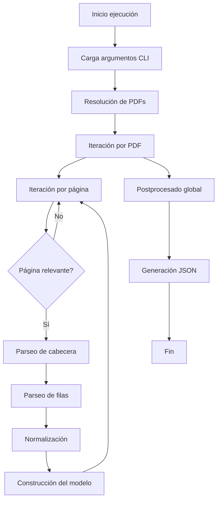
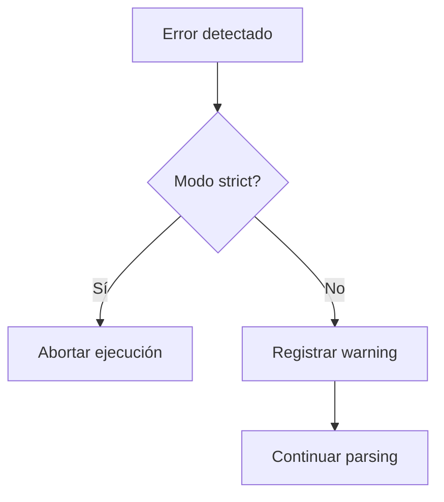
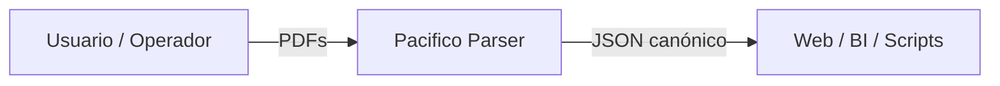
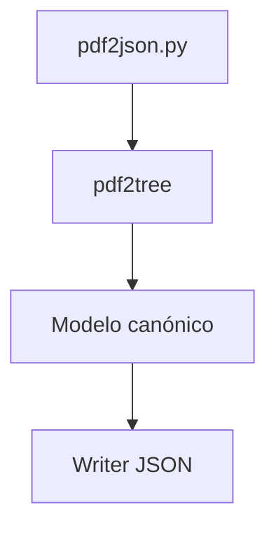
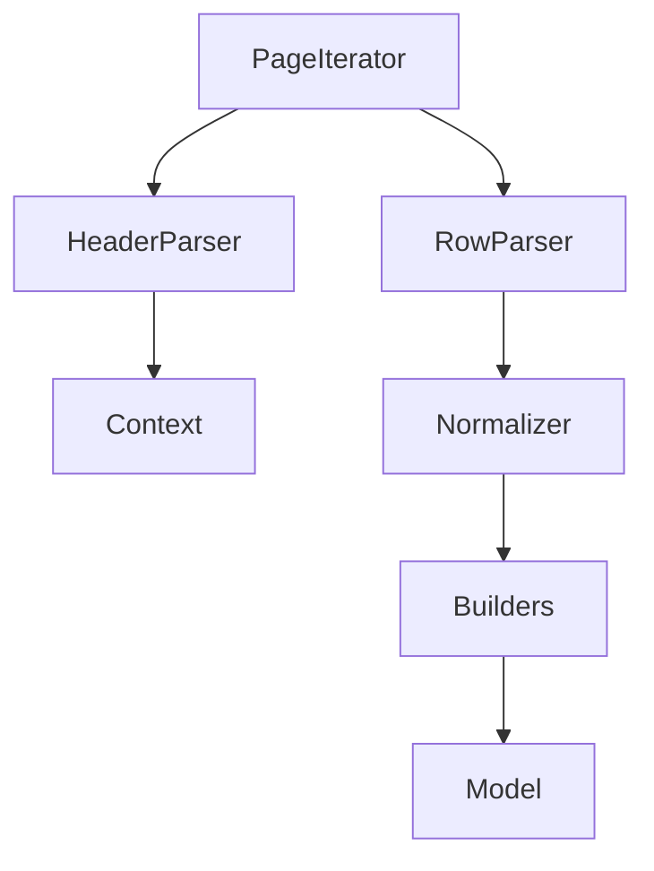
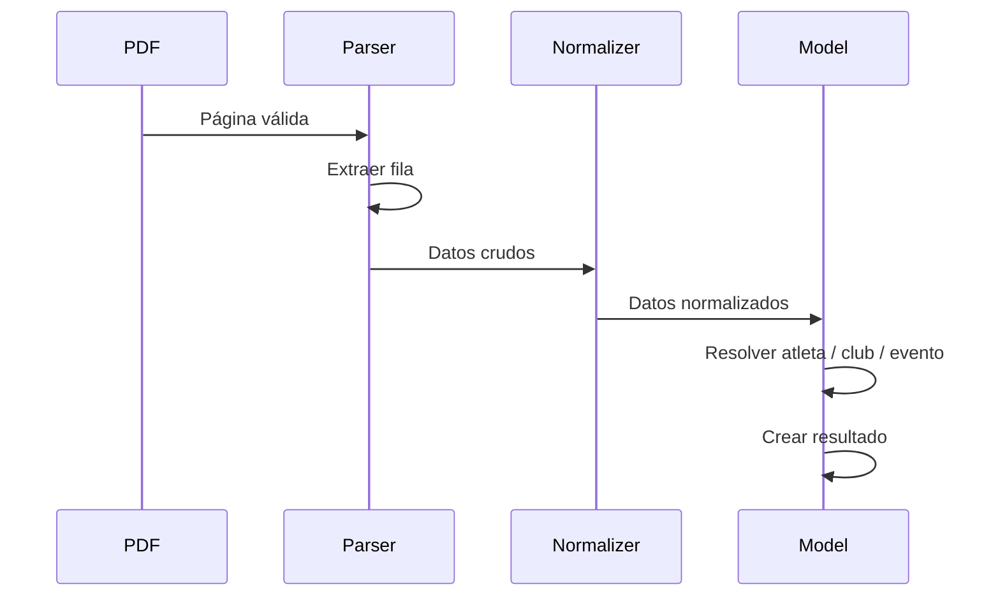
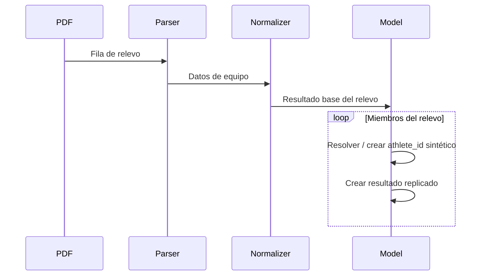
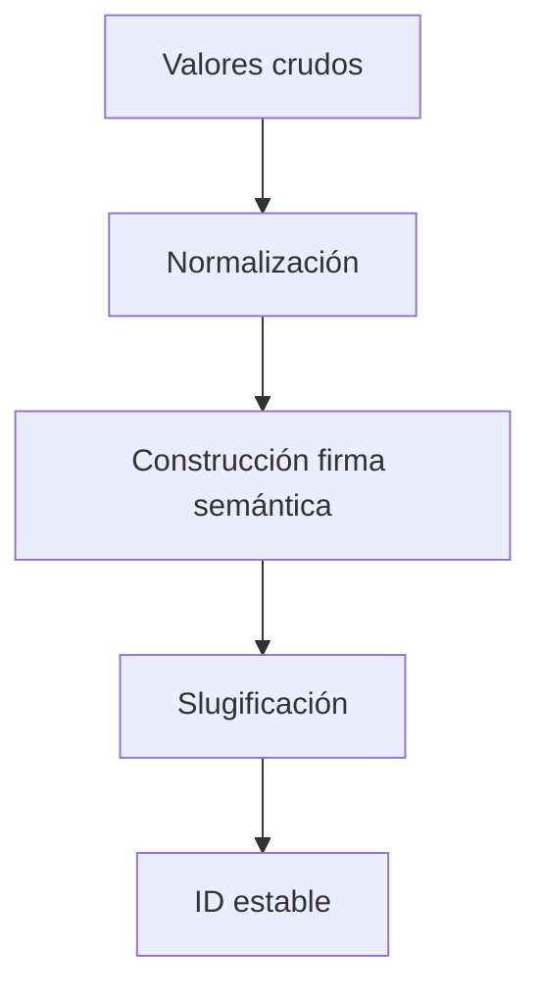

# TECHNICAL_REFERENCE.md

## Referencia técnica y transferencia de conocimiento (KT)

**Proyecto**: Pacifico – Conversión de resultados deportivos a JSON  
**Audiencia**: Desarrolladores, mantenedores, responsables de datos  
**Objetivo**: Transferencia de conocimiento completa sobre arquitectura, flujos, decisiones de diseño y reglas internas  
**Nivel técnico**: Medio–Alto  
**Versión del documento**: 1.2.0

---

## 1. Propósito de este documento

Este documento está diseñado como **material de Knowledge Transfer (KT)**. Su objetivo es que una persona que no ha participado en el desarrollo pueda:

- entender la **arquitectura completa del sistema**,
- comprender **cómo fluye la información** desde un PDF hasta el JSON final,
- conocer **las decisiones de diseño clave** y los compromisos asumidos,
- poder **modificar, extender o depurar** el sistema con seguridad y criterio.

Este documento **no sustituye al código**, pero sí explica el *porqué* de su estructura y comportamiento.

---

## 2. Visión general de la arquitectura

El proyecto sigue una arquitectura de tipo **pipeline secuencial**, donde cada fase transforma los datos y añade contexto, sin perder trazabilidad.

Fases principales:

1. **Entrada**: PDFs oficiales de resultados.
2. **Parseo estructural**: lectura página a página, detección de cabeceras y filas.
3. **Normalización**: limpieza lingüística, semántica y tipográfica.
4. **Modelado canónico**: construcción de entidades (`dimensions`) y resultados (`results`).
5. **Postprocesado**: deduplicación y remapeos.
6. **Salida**: generación del JSON contractual.

Principios de diseño fundamentales:

- **Tolerancia a errores**: el sistema prioriza no perder datos.
- **Idempotencia**: reprocesar los mismos PDFs no cambia el resultado.
- **Trazabilidad**: todo resultado puede rastrearse a su PDF de origen.
- **Estabilidad de IDs**: los identificadores no cambian entre ejecuciones.

---

## 3. Diagrama de flujo general del sistema



### Explicación detallada del flujo

- **Carga argumentos CLI**: se interpretan rutas, comodines y flags (`--strict`).
- **Resolución de PDFs**: se determina el conjunto real de archivos a procesar.
- **Iteración por página**: cada página se evalúa de forma independiente.
- **Página relevante**: se descartan páginas administrativas (ej. "clasificación general").
- **Parseo de cabecera**: se extrae contexto de competición, prueba y serie.
- **Parseo de filas**: se obtienen resultados crudos (texto OCR o estructurado).
- **Normalización**: se corrigen inconsistencias y formatos.
- **Construcción del modelo**: se crean o reutilizan entidades canónicas.
- **Postprocesado global**: deduplicaciones y remapeos finales.
- **Generación JSON**: se emite el contrato definitivo.

---

## 4. Flujo de control de errores y fallback



### Explicación

- En **modo normal**, el sistema intenta continuar siempre que sea posible.
- En **modo estricto**, cualquier error estructural invalida la ejecución.
- Los errores no fatales quedan registrados para auditoría.

---

## 5. Arquitectura según el modelo C4

El **modelo C4** es un enfoque de documentación arquitectónica que describe un sistema en **niveles progresivos de detalle**:

1. **Contexto**: el sistema dentro de su ecosistema.
2. **Contenedores**: grandes bloques ejecutables.
3. **Componentes**: módulos internos relevantes.

Este enfoque permite que el lector empiece con una visión global y profundice gradualmente hasta el nivel de código.

---

### 5.1 C4 – Contexto



#### Explicación

- El sistema **no interactúa directamente con bases de datos ni servicios externos**.
- Toda la entrada es explícita (PDFs) y toda la salida es explícita (JSON).
- El JSON generado actúa como **fuente única de verdad** para sistemas consumidores.

---

### 5.2 C4 – Containers



#### Explicación detallada

##### `pdf2json.py` (CLI)

- Punto de entrada del sistema.
- Responsabilidades:
  - parsear argumentos de línea de comandos,
  - resolver rutas y comodines,
  - inicializar el contexto de ejecución,
  - orquestar el pipeline completo.

No contiene lógica de negocio.

##### `pdf2tree/` (núcleo del sistema)

Contiene **toda la lógica de parsing y normalización**. Es el corazón del proyecto.

Responsabilidades:

- iterar páginas de PDF,
- detectar cabeceras y cambios de contexto,
- extraer filas de resultados,
- aplicar reglas de normalización.

##### Modelo canónico

- Gestiona las estructuras `dimensions` y `results`.
- Garantiza unicidad, estabilidad y consistencia.
- Aplica reglas de deduplicación y remapeo.

##### Writer JSON

- Serializa el modelo en el contrato definido.
- No modifica datos, solo los representa.

---

### 5.3 C4 – Components (detalle de `pdf2tree`)



#### Componentes principales

##### `PageIterator`

- Recorre páginas del PDF.
- Decide si una página es relevante.
- Mantiene el estado de página actual.

##### `HeaderParser`

- Extrae información contextual:
  - competición,
  - fecha,
  - prueba,
  - tipo de serie.
- Detecta cambios de evento dentro del mismo PDF.

##### `RowParser`

- Convierte líneas de texto en estructuras crudas.
- Tolera errores de OCR y formatos inconsistentes.

##### `Normalizer`

- Aplica reglas lingüísticas y semánticas.
- Unifica capitalización, distancias, disciplinas.
- Elimina ruido administrativo.

##### `Builders`

- Construyen entidades canónicas:
  - atletas,
  - clubes,
  - eventos,
  - resultados.

---

## 6. Diagramas de secuencia

### 6.1 Secuencia – Prueba individual



#### Explicación

Cada fila del PDF genera **exactamente un resultado**, asociado a un atleta real.

---

### 6.2 Secuencia – Prueba de relevos



#### Explicación

Un relevo genera **N resultados**, uno por miembro, replicando los datos de equipo.

---

## 7. Anexos técnicos

### Anexo A – Reglas de normalización

- eliminación de textos administrativos (ej. "Fase Territorial"),
- capitalización según reglas del español,
- normalización de distancias (`4x25 m`),
- eliminación de sufijos de sexo y categoría en nombres base.

---

### Anexo B – Reglas de creación de IDs

Los identificadores:

- se basan en valores semánticos,
- son deterministas,
- no incluyen datos volátiles,
- no dependen del orden de procesamiento.

#### Diagrama de generación de IDs



Ejemplo conceptual:

```
e_<distancia>_<disciplina>_<categoria>_<sexo>
```

---

### Anexo C – Reglas de deduplicación

- **Atletas**: nombre + año (si existe).
- **Clubes**: nombre normalizado.
- **Eventos**: firma semántica completa.
- **Resultados**: clave compuesta estable.

---

### Anexo D – Remapeo de deportistas

Cuando un atleta aparece inicialmente sin año y posteriormente con año:

- se conserva el ID más completo,
- se migran los resultados previos,
- se evita la duplicación histórica.

---

### Anexo E – Casos extremos reales

- PDFs con OCR defectuoso,
- filas partidas o desplazadas,
- relevos sin miembros explícitos,
- clubes concatenados con dorsales o años.

El sistema prioriza siempre:

- no perder datos,
- no inventar información.

---

### Anexo F – Guía de extensión del sistema

Este anexo describe **cómo extender el sistema de forma segura**, sin romper compatibilidad ni contratos existentes.

#### F.1 Añadir soporte para un nuevo formato de PDF

1. Analizar si el formato rompe:
   - estructura de cabeceras,
   - estructura de filas.
2. Ajustar o extender `HeaderParser` y/o `RowParser`.
3. Añadir casos de prueba con PDFs reales.

Nunca modificar directamente el modelo para adaptarlo a un PDF concreto.

---

#### F.2 Añadir una nueva regla de normalización

1. Implementar la regla en `Normalizer`.
2. Asegurarse de que es:
   - determinista,
   - idempotente,
   - no destructiva.
3. Documentar la regla en `JSON_CONTRACT.md` si afecta a la salida.

---

#### F.3 Añadir un nuevo campo al JSON

1. Definir el campo en el modelo canónico.
2. Marcarlo como opcional.
3. Actualizar `JSON_CONTRACT.md`.
4. No eliminar ni reutilizar campos existentes.

---

#### F.4 Modificar reglas de deduplicación

⚠️ **Cambio crítico**

- Evaluar impacto histórico.
- Considerar migración de datos antiguos.
- Versionar el contrato si es necesario.

---

#### F.5 Principios que no deben romperse

- estabilidad de IDs,
- semántica de relevos,
- idempotencia del pipeline,
- no invención de datos.

---

## 8. Cierre

Este documento, junto con:

- `INSTALLATION_GUIDE.md`
- `USER_GUIDE.md`
- `JSON_CONTRACT.md`

proporciona una **visión completa, técnica y transferible** del proyecto.

---

**Fin del documento**
