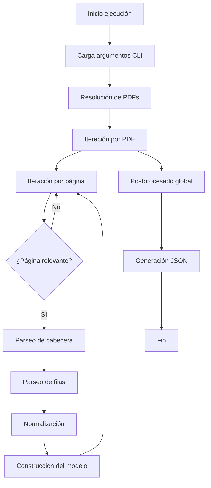

# TECHNICAL_NOTE — Merge CLI (`merge_pacifico.py`)

Nota técnica breve para mantenedores.

---

## 1. Diseño

Se separa en:

- **CLI** (`merge_pacifico.py`): parsing de argumentos, logging y reporte.
- **Lógica de merge** (`pacifico_merge/merger.py`): merge de dimensions/results/tree.
- **Validación** (`pacifico_merge/validate.py`): checks estructurales y referencias cruzadas.
- **Utilidades** (`pacifico_merge/utils.py`): load/save JSON y helpers.

Esta separación facilita mantenimiento, test y KT.

---

## 2. Diagrama de flujo general del sistema

---

## 3. Merge

### 3.1 Dimensions

Merge por `id` en:

- `seasons`, `clubs`, `athletes`, `competitions`, `events`.

### 3.2 Results

Merge por `result.id`.

### 3.3 Tree

- Indexación para evitar búsquedas lineales repetidas.
- Deduplicación por clave compuesta:

`athlete_id|series_type|heat`

> `series_type` y `heat` se consideran obligatorios (contrato actual). Si faltan, la deduplicación no puede operar correctamente; la validación lo reporta como warning.

---

## 4. Validación

- Duplicados en IDs (dimensions/results).
- Referencias cruzadas de results a dimensions.
- Referencias de tree a dimensions (warnings).

---

## 5. Extensiones futuras sugeridas

- Subir a **error** (no warning) la ausencia de `series_type`/`heat` cuando se cierre la compatibilidad histórica.
- Añadir `--fix` (reconstrucción opcional de tree desde results si se decide que tree sea derivado).
- Tests unitarios mínimos para merger/validate.
